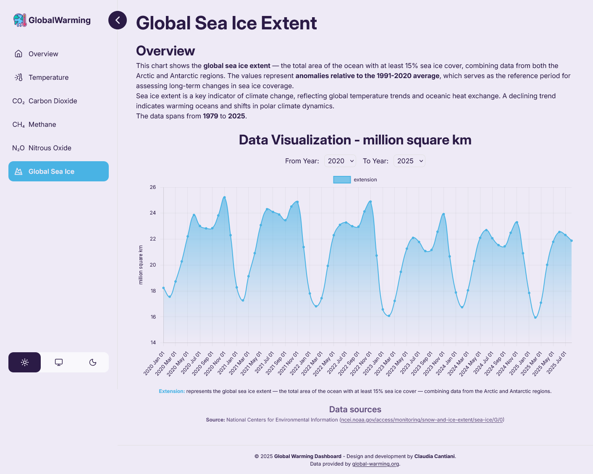
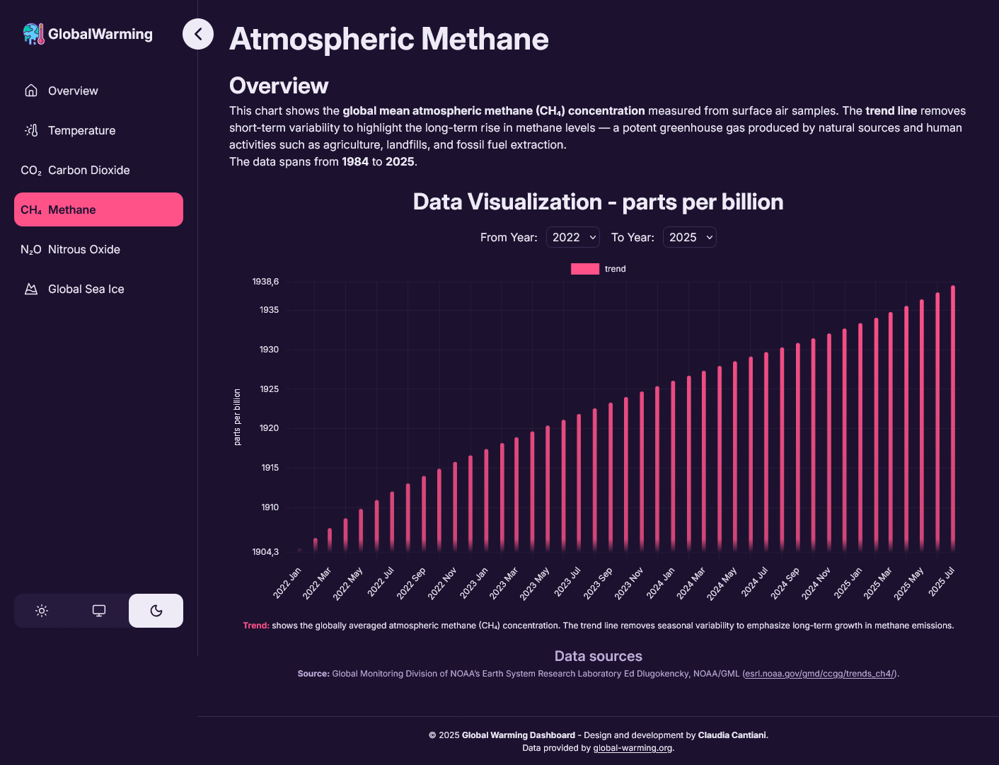
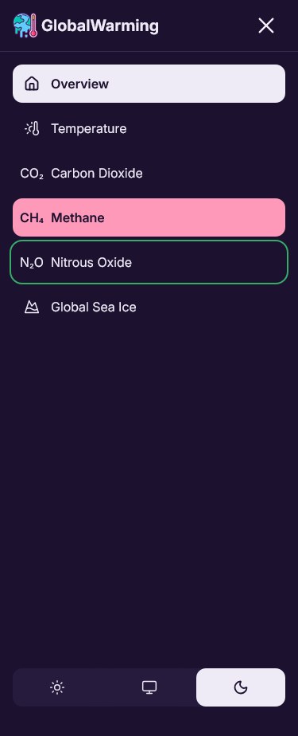
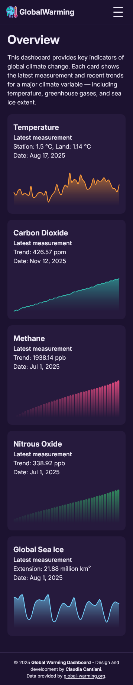
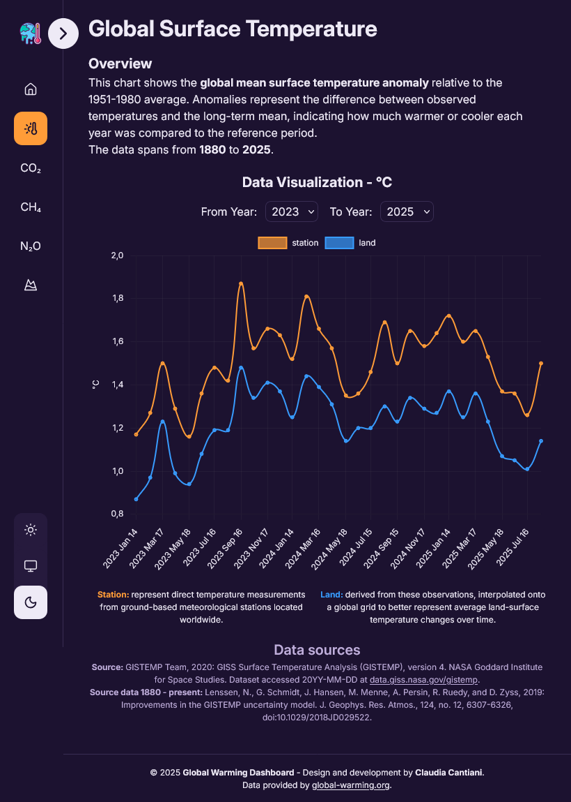
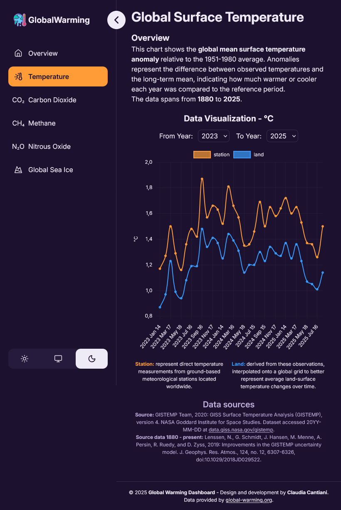

# Global Warming Dashboard

Welcome to the Global Warming Dashboard — a modern single-page application designed to help users explore, understand, and visualize key global-warming indicators through clean UI, responsive layout, and interactive data-driven charts.

Live site: [Global Warming Dahsboard](https://cla91-global-warming-dashboard.netlify.app/)

## Table of contents

- [Overview](#overview)
  - [Requirements](#requirements)
  - [Screenshot](#screenshot)
- [My process](#my-process)
  - [Features](#features)
  - [Technologies used](#technologies-used)
- [Getting started](#getting-started)
  - [Installation](#installation)
  - [Project structure](#project-structure)
- [Credits](#credits)

## Overview

### Requirements

Here’s what the dashboard was designed to include:

- A homepage with category cards showing the most recent values and sparkline previews.
- Dedicated pages for each dataset:
  - Global Temperature
  - CO₂
  - CH₄
  - N₂O
  - Global Sea Ice
- Each category page must display:
  - An interactive chart
  - A year-range filter
  - A legend explaining dataset components
  - Unit-aware visualization
  - A short descriptive overview
  - A footer with scientific sources
- A clean, intuitive, and accessible UI/UX.
- A fully responsive layout with a sticky collapsible sidebar.
- Smooth animations during sidebar collapse/expand.
- A theme switcher (Light / Dark / System).
- Organized, maintainable architecture with reusable components.
- Data fetched from a public climate-data API.

### Screenshot

The menu when it's a sidebar is sticky, so it takes the full height and scrolls with the content.








## My process

### Features

- Dynamic Category Cards: The homepage displays a set of cards with the latest recorded values and a sparkline preview generated using Chart.js.
- Dedicated Data Pages, each page provides:
  - Interactive charts
  - Smoothly animated transitions
  - Year filtering (start/end)
  - Legends with dataset descriptions
  - Highly readable overview text
- Lazy Loading via Rect.lazy + Suspense, all category pages are code-split to improve initial load time:
  - Static assets and core layout load instantly
  - Secondary pages load on demand when the user navigates to them
- Sticky Collapsible Sidebar, which includes:
  - Smooth width animation (full → icons-only)
  - Collapsible logo
  - Animated navigation links
  - Mobile menu with sliding transition
  - ThemeSwitcher that adapts layout when minimized
- Theme Switcher (Light / Dark / System): Custom theme system that updates Chart.js in real time and respects OS preferences, persistent through localStorage
- Custom Hooks and independent logic for:
  - Data fetching
  - Managing chart refresh on theme change
  - Extracting year ranges
  - Filtering datasets
- Error Handling and a dedicated error page displays:
  - Route errors (React Router)
  - API errors
  - User-friendly messages
- Smooth User Experience: Carefully crafted transitions, responsive SCSS modules, and a focus on accessibility and clarity.
- Alias based imports, for cleaner and more maintainable import paths using Typescript paths configuration

### Technology used

This project is built with a modern and performant stack..

**Frontend**

- React + TypeScript – Foundation of the UI.
- React Router – For client-side routing and error boundaries.
- React Query + axios – Efficient data fetching, caching, and synchronization.
- React.lazy + Suspense — Code splitting and on-demand page loading
- SCSS Modules – Scoped, maintainable styling with variables and mixins.
- Chart.js – Line and bar charts with custom theme integration.
- lucide-react – Icon library with scalable vector icons.
- Custom Hooks – Encapsulated logic for reusability and clean architecture.
- Vite – Lightning-fast development environment and build tool.

**API Handling**
All climate data is served by:
https://global-warming.org/api
Multiple endpoints provide CO₂, CH₄, N₂O, temperature anomalies, and sea-ice data.
All requests are handled through React Query, ensuring:

- caching
- minimized API calls

## Getting started

To get a local copy up and running, follow these simple steps.
You will need Node.js and npm installed on your machine.

### Installation

Clone the repository:

```
    git clone [https://github.com/your-username/global-warming-dashboard.git](https://github.com/your-username/global-warming-dashboard.git)
```

Navigate to the project directory:

```
    cd global-warming-dashboard
```

Install the dependencies:

```
    npm install
```

Start the development server:

```
    npm run dev
```

Build for production:

```
    npm run build
```

Preview the production build:

```
    npm run preview
```

### Project structure

The project is structured to prioritize component reusability and feature separation.

```
/src
├── components/
│   ├── layout/          # Header, Navigation, Footer, Wrapper,...
│   ├── ui/              # Buttons, cards, icons, ThemeSwitcher,...
│         └── chart/           # Chart.js wrappers
├── pages/               # Category pages + Home + Error
├── api/                 # Axios get function
├── types/               # Types and Interfaces
├── chartUtils/          # Helper functions and options
├── hooks/               # Custom hooks for fetching, layout, ...
├── utils/               # Helpers: getYearRange, filtering, theme sync
├── assets/              # Images
├── data/                # Legends
├── styles/              # Global styles, mixins, variables,...
├── App.tsx              # Main application wrapper
└── routes.tsx           # Route configuration + error handling

```

## Credits

This project was built and designed by **Claudia Cantiani**.

Data provided by: global-warming.org/api
Icons by: lucide-react
Font: Inter (Google Fonts)
